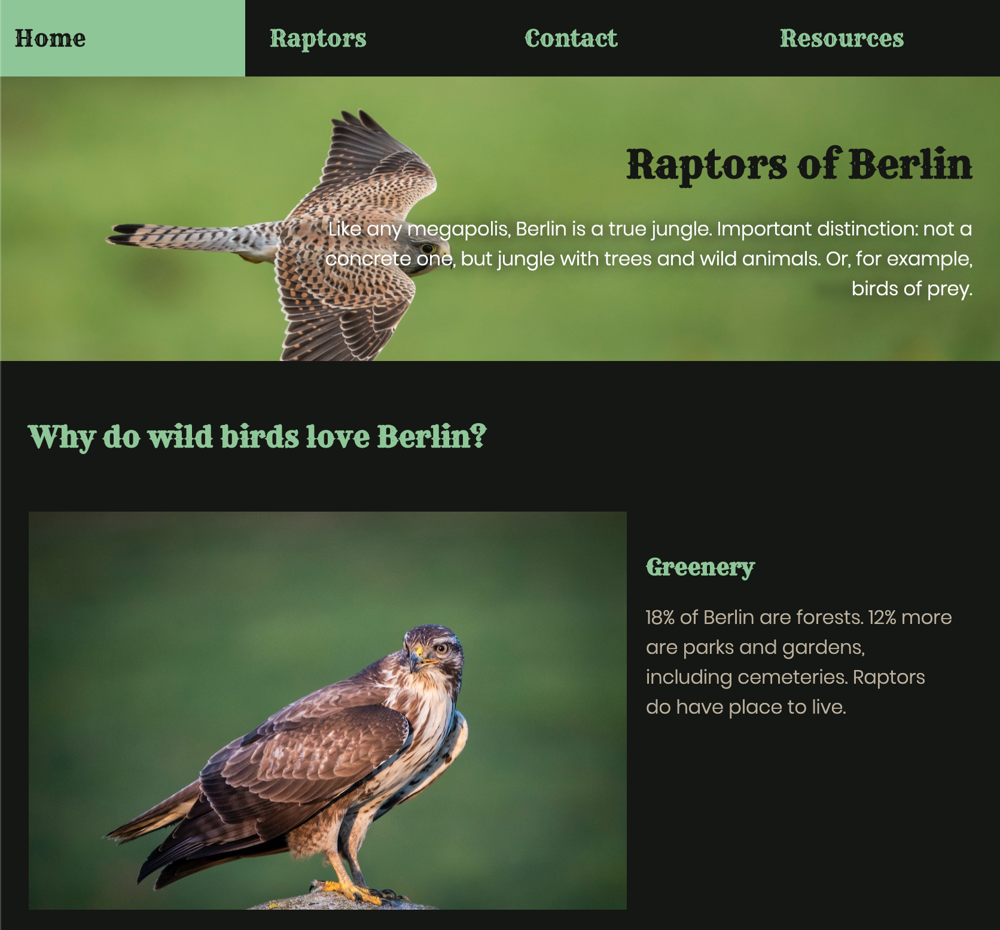

# Raptors of Berlin

## About

The project was made for the Orientration course at DCI, Berlin's school for digital education. [Raptors of Berlin: the web version](https://olhanotolga.github.io/raptors_of_berlin/) is hosted on GitHub Pages.

As a nature nerd who happens to live in a wilderness-rich city of Berlin, my project is dedicated to the awesome birds of prey one can spot here.

## Technology and concepts

**Languages:** HTML, CSS
I did not use anything apart from these two as part of the course project.
Yet I'm planning to test out some other technologies here in the future.

**Concepts:** Responsiveness
I found that **CSS Flexbox** was perfect for arranging the navigation bar and some of the page sections on the website. The layout could be easily modified and adjusted with **media queries**.

## The visual part

The colors I used here are based on one of the bird photos. The two fonts (Poppins and Rye) are taken from Google Fonts.
